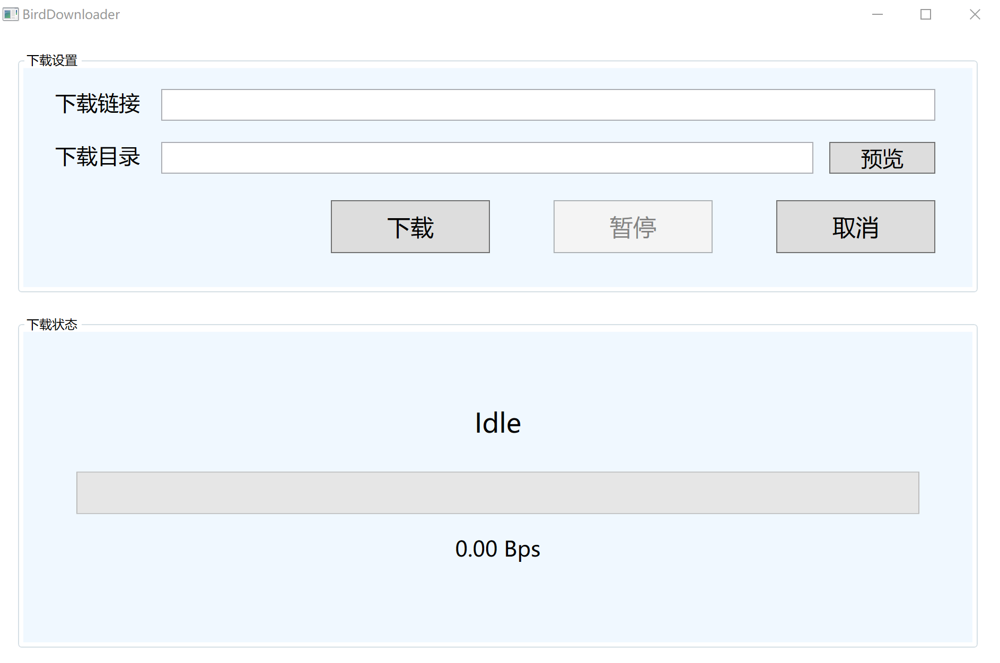

# Resumable_Downloader

WPF应用程序项目（使用Prism MVVM框架），基于HTTP协议的文件下载器（支持断点续传）。

开发环境：.NET6.0	VS2022Community

主界面（View）如下，使用VS2022自带xaml设计器设计：



主逻辑（ViewModel）位于DownloadViewModel.cs中。

目前支持功能：输入下载链接、下载目录（下载目录可通过“预览”打开文件对话框便捷选择）进行单线程后台下载；下载时若发现下载目录下有同名临时文件（.tmp），则进行续传下载；下载中途暂停下载，继续下载，任意时刻取消下载；实时显示下载进度及下载速度。

## 开发日志

### 2022/8/24

第一个可基本顺利运行的版本完成。待改进之处：暂停下载功能引入了一些忙等待机制，对性能有一定影响：

```c#
//下载，进度条进度更新
fileStream.Write(buffer, 0, readLen);
ProgressValue += readLen;
//有点忙等待的写法，用于暂停、暂停时取消、取消时的停止下载效果，尚可改进
while (isPausing && isDownloading)
{
    System.Threading.Thread.Sleep(100);
}
readLen = stream.Read(buffer, 0, buffer.Length);
```

